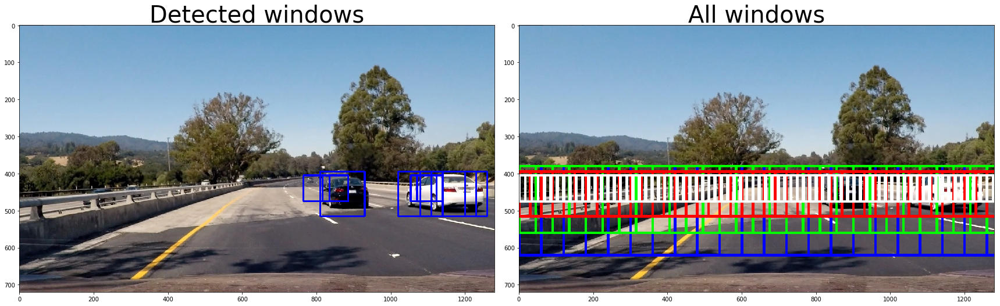

# CarND Vehicle Detection Project

---

**Vehicle Detection Project**

The goals / steps of this project are the following:

1. Explore Dataset & Color Spaces

2. Make Histogram of Oriented Gradients (HOG) feature extraction on a labeled training set of images and train a Linear SVM (Support Vector Machine) classifier. Combine the HOG feature vector with color transform and binned color features

3. Implement sliding-window scheme to search for cars using the trained SVM

4. Creation heatmap function for detections in subsequent framens of a video stream to reject faulse positives and follow detected vehicles.

The goal of our project is to find road vehicles on images and to track its on video. Ащк еру зкщоусе Ш гыу the histogram of oriented gradients (HOG) and support vector machines (SVM).

In the begining I trained a vehicle classification model using Linear SVM algorithm.

Then I extracted the features using the HOG, Color Histograms and Special Binning schemes 

After I used sliding window scheme to extract image areas patches from full road images. These image areas were used to extract features. I checked these features on SVM model to find out whether this area contain vehicle.

Then I used hot map scheme to remove duplicates and false positives. 
Detected vehicles were drawn by bounding boxes to indicate its on images.
Then I implemented pipeline on video.

** See full code: **

[CarND-Vehicle-Detection+Solution.html](CarND-Vehicle-Detection+Solution.html)

or

Notebook CarND-Vehicle-Detection Solution.ipynb

# 1. Explore Dataset & Color Spaces

We explore images using 3D vizualization in diffenrent colour spaces.

Full image shape (130, 130, 3)

Small image shape (32, 32, 3)

Feature vector shape (3072,)

** Spatially Binned Features **

** Big dataset contains **

Number of vehicle files: 8792
Number of non-vehicle files: 8968

** Small dataset contains **
Number of vehicle files: 1196
Number of non-vehicle files: 1125

# 2. Make Histogram of Oriented Gradients (HOG) feature extraction on a labeled training set of images and train a Linear SVM (Support Vector Machine) classifier. Combine the HOG feature vector with color transform and binned color features

I try different combinations of parameters - color spaces and HOG options. The most valuable is HLS color space. RGB color space is not relyable because it is too dependant from changing light conditions. YUV and YCrCb is also not very stable. I choose HLS colour pace and value of pixels_per_cell=(8,8). Using values larger than cells_per_block=(2,2) did not improve results substancially. I used a linear SVM with all channels of images. I included spatial features color features as well as all three HLS channels. For color binning I use spatial_size=(16,16). For color histograms I used hist_bins=32. Test Accuracy of SVC = 0.9897

# 3. Implement sliding-window scheme to search for cars using the trained SVM

I used a scheme with 4 overlapping zones and different sliding window sizes to detect cars of different sizes on image. 
I choose the following window sizes: 240,180,120 and 70 pixels.
Overlapping for same size windows is 75%.
Search_all_scales(image) function is used to search over all zones.

# 5. Creation heatmap function for detections in subsequent framens of a video stream to reject faulse positives and follow detected vehicles.

In the class BoundingBoxes we implement a FIFO queue that collect the bounding boxes of the last n frames.

We add list of detected bounding boxes to every frame to the beginning of the queueю

The oldest list of bounding boxes are destroyed.

This queue is then used in the processing of the video. It contains information about the last n=20 frames. Thus we use the threshold 20. It eliminate false positives.

From the positive detections we create a heatmap and then thresholded that map to identify vehicle positions.

After that we used scipy.ndimage.measurements.label() to identify individual blobs in the heatmap. Each blob corresponds to a vehicle. 

At the very end we draw bounding boxes to cover the area of each blob detected.

## Video pipeline

Final video output:
[./output_images/processed_project_video.mp4](./output_images/processed_project_video.mp4)

Final video output (youtube):

[https://youtu.be/usiQW4kPjTo](https://youtu.be/usiQW4kPjTo)

# Discussion
Pipeline works at the whole but it has some faults. That's why I will make some improvements:
1. I'd like to implement YOLO Real-Time Object Detection. This technics could be faster:
https://pjreddie.com/darknet/yolo/
2. My CarND Vehicle Detection implementation still have some false positives and undetected vehicles. Thus I am going to check parameters and tune the model. Also I am going to use more labeled data.
